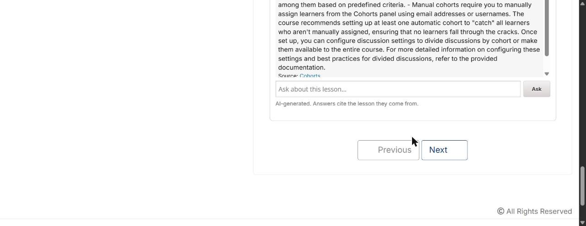

# CourseMate

**An AI tutor for Open edX that answers only from the course it lives in — and says so when it can't.**

CourseMate embeds a chat tutor inside an Open edX lesson. It answers from that
course's published content, cites the lesson each answer came from, and abstains
when the course doesn't cover the question rather than improvising from a model's
general knowledge.

Built against a real Open edX **Ulmo** instance with the 413-block demo course.

---

## What it does

| | |
|---|---|
| **Grounded** | Answers are built from retrieved course content, never from the model alone |
| **Cited** | Every answer links back to the lesson block it came from |
| **Abstains** | Below a confidence threshold it says *"that doesn't appear to be covered in this course"* — in **3 ms**, before any model call |
| **Authorised** | Enrollment is re-derived from Open edX on every request; a valid token is not sufficient |
| **Non-invasive** | No core Open edX changes, no fork. Installs as a plugin |

### The load-bearing architectural decision

**The LMS is never in the answer path.** The XBlock mints a short-lived JWT and
returns; the browser streams from the CourseMate service over a same-origin path
routed at the ingress.

Measured: **3 concurrent 4-second generations produced zero LMS log lines and
103 ms of LMS CPU — against a 118 ms idle baseline.** The obvious design (proxy
the stream through the XBlock) would have held one gunicorn worker per student
for the full generation. A worker pool is exhausted by *occupancy*, not
computation.

```
Browser ──1── XBlock.mint()  →  JWT          (0.115 ms; LMS released)
   │
   └────2──── /coursemate/api/chat  ──→  CourseMate service
              (same-origin, routed by Caddy, never enters an LMS process)
                                   │
                    retrieve → gate → LiteLLM → SSE stream → browser
```

---

## Screenshots

*Real Open edX lesson, real course content, `qwen2.5:7b` via Ollama. No mock.*

**Grounded answer with a citation back to the source lesson**



**Abstention — the behaviour that matters most**


Asked *"What were the main causes of the French Revolution?"*, the tutor replies
**"That doesn't appear to be covered in this course."** — instantly, with no model
call. The confidence gate fires before generation, so refusing costs 3 ms and
nothing in spend. A tutor that answers this question is worse than no tutor: a
student cannot tell a fabricated answer from a real one.

---

## Results

Measured on the Open edX demo course (231 indexed chunks, `qwen2.5:7b` via Ollama).

| | |
|---|---|
| recall@3 / recall@5 | **1.000** / 1.000 |
| MRR | 0.833 |
| Retrieval latency p95 | **12 ms** |
| False-answer rate (answered when it should abstain) | **0.000** |
| False-abstention rate | **0.000** |
| Citation correctness | 1.000 |
| Authorization matrix | **4/4 pass** |

Full methodology, the reranker A/B, and the bugs these numbers exposed:
[`docs/BENCHMARKS.md`](docs/BENCHMARKS.md).

---

## Quick start

Requires Docker, and Open edX via [Tutor](https://docs.tutor.edly.io/).

```bash
# 1. install the plugin
cp deploy/tutor-plugin/coursemate.yml "$(tutor plugins printroot)/"
tutor plugins enable coursemate
tutor config save

# 2. build the service image
docker build -f deploy/Dockerfile.deps    -t coursemate/deps:1      .
docker build -f deploy/Dockerfile.service -t coursemate/service:0.1.0 .

# 3. start, then index a course
tutor local start -d
tutor local run cms ./manage.py cms coursemate_reindex \
    --course course-v1:YourOrg+Course+Run --inline
```

Add `coursemate_tutor` to the course's Advanced Module List, drop the block into
a unit, publish. Full walkthrough: [`docs/DEPLOYMENT.md`](docs/DEPLOYMENT.md).

---

## Documentation

| Document | Contents |
|---|---|
| [`docs/ARCHITECTURE.md`](docs/ARCHITECTURE.md) | Components, data flows, diagrams, the decisions and their reasons |
| [`docs/DEPLOYMENT.md`](docs/DEPLOYMENT.md) | Installation, configuration, operations, troubleshooting |
| [`docs/BENCHMARKS.md`](docs/BENCHMARKS.md) | Evaluation methodology, results, bugs found by measurement |
| [`docs/LIMITATIONS.md`](docs/LIMITATIONS.md) | What does not work, and what would be built next |
| [`docs/PROJECT_STRUCTURE.md`](docs/PROJECT_STRUCTURE.md) | Repository layout and why each boundary exists |
| [`docs/TECHNICAL_SUMMARY.md`](docs/TECHNICAL_SUMMARY.md) | Engineering decisions, trade-offs, lessons |
| [`docs/CourseMate_Complete_Design.md`](docs/CourseMate_Complete_Design.md) | Full design document — every decision with its reason and rejected alternative |

---

## Development

```bash
make install     # venv + editable installs
make check       # architecture contracts + 66 tests, no Open edX required
```

Tests are self-contained — a clean checkout runs green with no environment setup.
CI ([`.github/workflows/ci.yml`](.github/workflows/ci.yml)) runs the same two
commands on Python 3.11 and 3.12, **plus a job that introduces a deliberate
contract violation and fails the build if the contract does not catch it.**

Tests run in seconds without a platform. Tests that need Tutor live in
`packages/coursemate-platform/tests/platform/` and run at milestones — a suite
that needs a platform is a suite nobody runs.

### Architecture enforced in CI

`.importlinter` turns six design promises into build failures:

1. Only `content_adapter` touches the modulestore
2. **The platform package imports nothing AI-shaped** — this is what makes *"CourseMate cannot degrade your LMS"* structurally true rather than aspirational
3. Reasoning reaches knowledge only through the `CourseIntelligence` boundary
4. Nothing imports the dormant proposal queue
5. Runtime packages never import the evaluation harness
6. Contracts import nothing but pydantic

Contract 2 has been verified to fail on a deliberate violation — a green contract
that cannot fail is decoration.

---

## Status

Working end to end and measured. **Not production-deployed.** The honest list of
what is missing — semantic retrieval, hosted inference, Feature B, the instructor
loop — is in [`docs/LIMITATIONS.md`](docs/LIMITATIONS.md) rather than omitted here.

## License

MIT — see [`LICENSE`](LICENSE).

The Open edX demo course used for development and benchmarking is published by the
Open edX community under **CC BY-NC-SA** and is **not redistributed here** — it is
fetched at setup time. Its Non-Commercial and Share-Alike terms do not compose
with MIT, which is why it is downloaded rather than vendored.

Open edX® is a registered trademark of edX Inc. CourseMate is an independent
plugin, modifies no Open edX source, and is not endorsed by or affiliated with
edX Inc.
