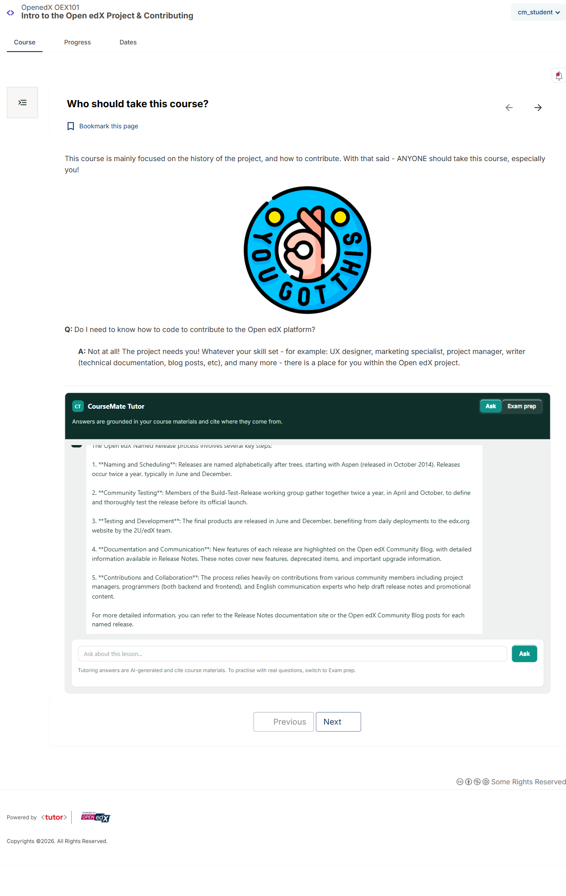
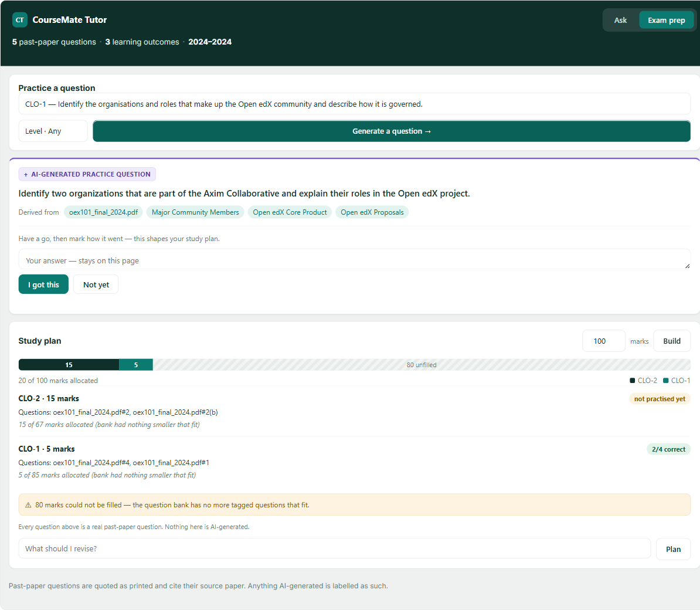
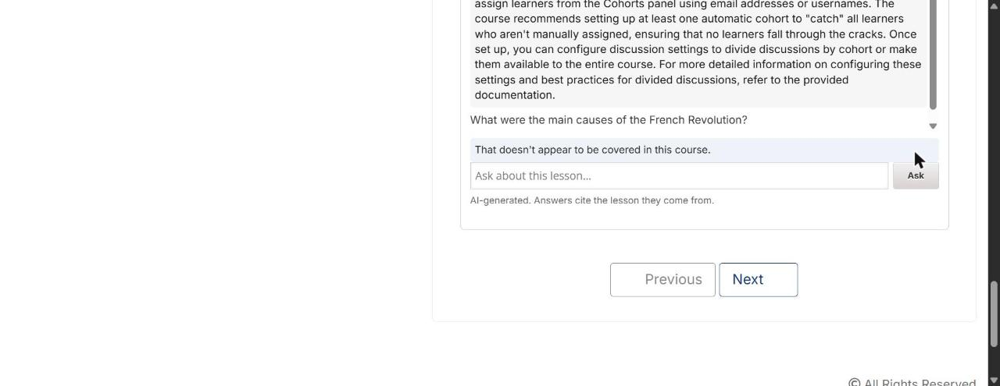

# CourseMate

**An AI tutor for Open edX that answers only from the course it lives in — and says so when it can't.**

CourseMate embeds a chat tutor inside an Open edX lesson. It answers from that
course's published content, cites the lesson each answer came from, and abstains
when the course doesn't cover the question rather than improvising from a model's
general knowledge.

Built and verified against a real Open edX **Ulmo** instance — two courses,
286 indexed chunks, a live Celery worker and a nightly sweep container.

---

## About

| | |
|---|---|
| **What it is** | An Open edX plugin — an XBlock plus a separate FastAPI service. No fork, no core changes |
| **Two features** | **A** — a grounded, cited chat tutor that abstains. **B** — exam prep: past-paper extraction, marks-budgeted study plans, generated practice questions |
| **The idea it is built on** | Retrieve, rank, then *gate*. The confidence check runs **before** the model, so refusing costs 3 ms and no spend |
| **Stack** | FastAPI · Pydantic · LiteLLM · SQLite FTS5/BM25 · Redis · Django/XBlock · Celery · Docker/Tutor |
| **Models** | `llama-3.3-70b` hosted for answers, `qwen2.5:7b` local for offline tagging, `nomic-embed-text` for duplicate detection |
| **Verified** | 1283 backend tests · 299 browser tests · 6/6 architecture contracts in CI · browser-verified as an enrolled student |
| **Status** | Running, measured, and **not production-ready** — the remaining gaps are operational and named in [`docs/LIMITATIONS.md`](docs/LIMITATIONS.md) |

**Where to start reading.** [`docs/FEATURE_A_HOW_IT_WORKS.md`](docs/FEATURE_A_HOW_IT_WORKS.md)
and [`docs/FEATURE_B_HOW_IT_WORKS.md`](docs/FEATURE_B_HOW_IT_WORKS.md) are
plain-English walkthroughs. [`docs/BENCHMARKS.md`](docs/BENCHMARKS.md) is every
number and how it was produced. [`docs/REFLECTION.md`](docs/REFLECTION.md) is what
went wrong, including what the AI that helped build this got confidently wrong.

---

## What it does

| | |
|---|---|
| **Grounded** | Answers are built from retrieved course content, never from the model alone |
| **Cited** | Every answer links back to the lesson block it came from |
| **Abstains** | Below a confidence threshold it says *"that doesn't appear to be covered in this course"* — in **3 ms**, before any model call |
| **Authorised** | Enrollment is re-derived from Open edX on every request; a valid token is not sufficient |
| **Access-aware** | Staff-only blocks never enter the index; cohort- and paid-track blocks are filtered per caller **inside the SQL**, so unauthorised content is never even a candidate |
| **Marks what it cannot support** | Sentences the retrieved material does not back are flagged in the answer, never silently rewritten |
| **Reads video** | Transcripts resolved through the platform's own resolver, which handles both storage paths Open edX uses |
| **Practises from real papers** | A past-paper PDF is extracted, CLO-tagged offline, and turned into a marks-budgeted study plan plus generated practice questions — each labelled AI-generated and cited to the paper and lessons it derives from |
| **Opt-in** | A course is indexed only if its staff added the tutor block. `--all` skips the rest and says how many |
| **Non-invasive** | No core Open edX changes, no fork. Installs as a plugin |

### The load-bearing architectural decision

**The LMS is never in the answer path.** The XBlock mints a short-lived JWT and
returns; the browser streams from the CourseMate service over a same-origin path
routed at the ingress.

Measured: **3 concurrent 4-second generations produced zero LMS log lines and
103 ms of LMS CPU — against a 118 ms idle baseline.** The obvious design (proxy
the stream through the XBlock) would have held one gunicorn worker per student
for the full generation. A worker pool is exhausted by *occupancy*, not
computation.

```
Browser ──1── XBlock.mint()  →  JWT          (0.115 ms; LMS released)
   │
   └────2──── /coursemate/api/chat  ──→  CourseMate service
              (same-origin, routed by Caddy, never enters an LMS process)
                                   │
                    retrieve → gate → LiteLLM → SSE stream → browser
```

---

## Screenshots

*Real Open edX lesson, real course content, real enrolled student. No mock.*

**The tutor inside a real lesson** — an XBlock an instructor dropped into a unit,
not a separate app the student has to leave the course for



**Exam prep — the whole of Feature B in one view**



Five things worth looking at in that one screenshot:

- The practice question carries an **AI-GENERATED** badge and a *Derived from*
  line citing the past paper **and** the three lessons it drew on
- The study plan is budgeted in **marks**, not question counts
- **"80 marks could not be filled"** — the bank ran short and the plan says so
  rather than padding
- Mastery shows as **`not practised yet`** and **`2/4 correct`**, self-marked,
  never a grade
- The footer states the line the feature is built around: *"Every question above
  is a real past-paper question. Nothing here is AI-generated."*


**Abstention — the behaviour that matters most**



> Captured 2026-07-31, before the UI redesign. Kept because the behaviour it
> shows is unchanged and it is the only capture of a refusal. The wording in it
> is still the wording `tutor.js` sends today.

Asked *"What were the main causes of the French Revolution?"*, the tutor replies
**"That doesn't appear to be covered in this course."** — instantly, with no model
call. The confidence gate fires before generation, so refusing costs 3 ms and
nothing in spend. A tutor that answers this question is worse than no tutor: a
student cannot tell a fabricated answer from a real one.

---

## Results

Measured against the live stack, `qwen2.5:7b` via Ollama.

| | |
|---|---|
| MRR | 0.833 |
| Retrieval latency p95 | **12 ms** |
| False-answer rate (answered when it should abstain) | **0.000** |
| False-abstention rate | **0.000** |
| Citation correctness | 1.000 |
| Authorization matrix | **4/4 pass** |

### Retrieval, and why one number is not enough

The original gold set scores **recall@3 = 1.000** — which says less than it
looks like. Those questions were written while reading the corpus, so they
inherited its vocabulary. Asking *"what are XBlocks?"* of a lesson titled
**XBlocks** measures string matching.

So a second arm was added: the same content, asked in words the lessons do not
use.

| Arm | n | recall@1 | recall@3 |
|---|---|---|---|
| Original — shares the lesson's words | 12 | 0.750 | **1.000** |
| Paraphrase — deliberately avoids them | 10 | 0.200 | **0.300** |

**And the part that matters more than the drop:** two of the ten paraphrase
questions retrieve the *wrong* lesson at a score **above** the confidence
threshold — so they are answered rather than abstained. The gate catches a weak
match; it does not catch a confident match on wrong content. That failure is
invisible to a student, because the answer is fluent, cited, and grounded — in
the wrong lesson.

This is the honest state of lexical-only retrieval, and it is the baseline
semantic retrieval has to beat.

Full methodology, the reranker A/B, and the bugs measurement exposed:
[`docs/BENCHMARKS.md`](docs/BENCHMARKS.md).

---

## Model selection rationale

**Which model answers is configuration, never code.** Three logical deployments
are registered from environment variables; swapping a provider is an env var and
a restart. `ADR-0001` records the topology and the decisions behind it.

| slot | job | current |
|---|---|---|
| `strong` | every student answer, and all question generation | `openrouter/meta-llama/llama-3.3-70b-instruct` |
| `fallback` | cross-vendor failover | *unset* |
| `cheap` | the CLO tagger, and the last-resort floor for chat | `ollama_chat/qwen2.5:7b` (local) |

    chat        strong → fallback → cheap
    generation  strong → fallback            never the local floor

### Why these, and why in this order

**A hosted model answers, a local model catches.** Measured on identical
retrieved context (`BENCHMARKS §3.11`): the hosted 70B model answered ~11× faster
end to end, in half the words, with zero unsupported sentences across both
questions. The local 7B is ~25 s cold on CPU and times out on nine of ten agent
planning calls. It is not a credible primary on this hardware.

**But local is the floor, not the discard.** When the hosted provider was
disabled the local model answered with the same three citations and the UI
reported `DEGRADED` — verified against a real outage, not a mock. A tutor that
degrades is better than one that disappears.

**The ordering is a policy, and it is yours to set.** Local-last means student
questions leave the machine in normal operation. An institution that cannot allow
that inverts the chain with environment variables — offline-only is a supported
configuration, not a fork. Quality argues one way, privacy the other, and both
are right for different operators.

**Generated practice questions never come from the local floor.** They reach a
student with no instructor gate, which §9.0 permits *because the output is
measured* — and the Feature B rubric scored the strong model, not qwen. With no
`fallback` configured, generation fails honestly rather than quietly serving an
unmeasured model. That asymmetry against chat is deliberate.

### What this does not yet do

`fallback` is unset, so the live chain is hosted → local. That is two providers,
and it is **not** cross-vendor failover between hosted vendors. Adding a second
hosted vendor is one env var; it is deferred rather than done.

`provider_failures_total` cannot detect a silently degrading primary — the
counter only fires when the whole chain fails. See `BENCHMARKS §4.6`.

---

## What measurement found that review did not

Every one of these passed code review and returned success while being wrong.
They are listed because they are the strongest argument for how this was built,
not in spite of being embarrassing.

| Defect | Why it survived |
|---|---|
| The confidence gate **could never fire** | `score = raw / best` makes the top hit exactly 1.0 for every query. The gate existed, had tests, and was structurally incapable of triggering. |
| A 226-block course **served 26 blocks** | Each ingest batch swapped itself in and deactivated its predecessors. Nothing failed; the content silently vanished. |
| Celery **discarded every task** while Publish returned 200 | The package was `docker cp`'d, so pip installed no dist-info, so the entry point was absent, so the app never reached `INSTALLED_APPS`. Only visible in a worker log. |
| The enqueued reindex **activated nothing** | It never sent `is_final`, so the swap never ran. It reported `indexed == total`, because that counts what the service accepted, not what went live. Found only when a second course made the totals stop matching. |
| A partition lookup was **a write, not a read** | Its docstring says it assigns a group and *persists* that decision. Called per token mint, it would have enrolled students into A/B experiment groups for opening the chat box. Caught by reading the platform source rather than trusting the function name. |
| A frame type the UI rendered and **nothing ever emitted** | `UNSUPPORTED_CLAIM` shipped in the contract, was handled in the browser, and had no producer — so the documented check did not exist. |

The common shape: **the failure path returned success.** That is why the probes
in [`tools/verification/`](tools/verification/) assert on what a user would
check, and why every "empty" result in them is disambiguated — a control that
fails closed hides its own failure.

---

## Quick start

Requires Docker, and Open edX via [Tutor](https://docs.tutor.edly.io/).

```bash
# 1. install the plugin
cp deploy/tutor-plugin/coursemate.yml "$(tutor plugins printroot)/"
tutor plugins enable coursemate
tutor config save

# 2. build the service image
docker build -f deploy/Dockerfile.deps    -t coursemate/deps:1      .
docker build -f deploy/Dockerfile.service -t coursemate/service:0.1.0 .

# 3. bake the plugin INTO the Open edX image -- not optional
#    `docker cp` puts code on sys.path but installs no dist-info, so pip's
#    cms.djangoapp entry point is absent, the app never reaches INSTALLED_APPS,
#    Celery autodiscovers nothing, and every enqueued task is discarded while
#    Studio's Publish button still returns 200.
rsync -a packages "$(tutor config printroot)/env/build/openedx/coursemate/"
tutor config save && tutor images build openedx     # ~30 min with a warm cache

# 4. start, migrate, index
tutor local start -d
tutor local run cms ./manage.py cms migrate coursemate_platform
tutor local run cms ./manage.py cms coursemate_reindex \
--course course-v1:YourOrg+Course+Run --inline
```

Add `coursemate_tutor` to the course's Advanced Module List, drop the block into
a unit, publish. Full walkthrough: [`docs/DEPLOYMENT.md`](docs/DEPLOYMENT.md).

---

## Documentation

| Document | Contents |
|---|---|
| [`docs/PROBLEM_STATEMENT.md`](docs/PROBLEM_STATEMENT.md) | The problem this attacks, and the ones it deliberately leaves alone |
| [`docs/ARCHITECTURE.md`](docs/ARCHITECTURE.md) | Components, data flows, diagrams, the decisions and their reasons |
| [`docs/DEPLOYMENT.md`](docs/DEPLOYMENT.md) | Installation, configuration, operations, troubleshooting |
| [`docs/BENCHMARKS.md`](docs/BENCHMARKS.md) | Evaluation methodology, results, bugs found by measurement |
| [`docs/LIMITATIONS.md`](docs/LIMITATIONS.md) | What does not work, and what would be built next |
| [`docs/PROJECT_STRUCTURE.md`](docs/PROJECT_STRUCTURE.md) | Repository layout and why each boundary exists |
| [`docs/TECHNICAL_SUMMARY.md`](docs/TECHNICAL_SUMMARY.md) | Engineering decisions, trade-offs, lessons |
| [`docs/CourseMate_Complete_Design.md`](docs/CourseMate_Complete_Design.md) | Full design document — every decision with its reason and rejected alternative |
| [`docs/adr/`](docs/adr/) | Decision records for choices made after the design doc was written |

---

## Development

```bash
make install     # venv + editable installs
make check       # 6 architecture contracts, OpenAPI drift check (18 paths),
                 # 1262 backend + 297 browser tests. No Open edX required
```

Tests are self-contained — a clean checkout runs green with no environment setup.
CI ([`.github/workflows/ci.yml`](.github/workflows/ci.yml)) runs the same two
commands on Python 3.11 and 3.12, **plus a job that introduces a deliberate
contract violation and fails the build if the contract does not catch it.**

Tests run in seconds without a platform. Tests that need Tutor live in
`packages/coursemate-platform/tests/platform/` and run at milestones — a suite
that needs a platform is a suite nobody runs.

### Architecture enforced in CI

`.importlinter` turns six design promises into build failures:

1. Only `content_adapter` touches the modulestore
2. **The platform package imports nothing AI-shaped** — this is what makes *"CourseMate cannot degrade your LMS"* structurally true rather than aspirational
3. Reasoning reaches knowledge only through the `CourseIntelligence` boundary
4. Nothing imports the dormant proposal queue
5. Runtime packages never import the evaluation harness
6. Contracts import nothing but pydantic

Contract 2 has been verified to fail on a deliberate violation — a green contract
that cannot fail is decoration.

---

## Status

**Runs end to end on a live Open edX Ulmo stack, and is measured. Not published,
not production-deployed.**

| | |
|---|---|
| Verified working | Ingestion on publish, bootstrap, nightly sweep, video transcripts, retrieval, citations, abstention, enrollment re-derivation, block-level access, claim marking, two-course isolation |
| Verified in a real browser (2026-08-12) | Exam-prep tab, budgeted study plan, generated practice question with provenance, abstention — as an enrolled non-staff student on the live stack |
| Verified in a real browser (2026-08-20) | Source chips (a paper renders as an inert `span`, a lesson as a working link into the courseware), mastery badge repainting without a reload, and a 70-mark plan rendering "35 of 70 marks" with its shortfall line — asserted against the live DOM and real clicks, not a test harness |
| Test suite (2026-08-19) | 6 contracts kept / 0 broken · OpenAPI current, 18 paths · **1262 backend passed + 3 xfailed** · **297 browser passed across 9 suites**, 0 failed |
| Runs on | Tutor 21.0.8 / Open edX Ulmo, single node |
| Not tried on | Other releases, Kubernetes, Learning Core, multiple replicas |
| Not installable yet | Nothing is on PyPI or a public registry — this is a clone-and-build repo |

**What a student can currently do**, all running on the live stack:

* **Ask for practice on a specific learning outcome.** A generated question is
  modelled on a real past-paper question, labelled AI-generated, and cited to
  both the paper and the lessons it drew on.
* **Get an honest refusal.** An outcome with no past-paper question to model on
  produces an abstention, not an invented question — and the generator now tries
  the *other* retrieved candidates before refusing, so an outcome is only
  declined when none of its seeds can be grounded.
* **Budget a revision session in marks.** The plan states what was asked for and
  what could actually be filled, so a short question bank is reported as a
  shortfall rather than padded or silently truncated.
* **See where a question came from.** Source chips link into the courseware when
  a real destination exists, and render as plain text when one does not — a
  paper's identifier is not a link.
* **Track their own progress per outcome**, self-assessed, which feeds the
  weakest-first ordering of the next plan.

**Known gaps, in the order they would be fixed** — the full list with reasons is
in [`docs/LIMITATIONS.md`](docs/LIMITATIONS.md), which is deliberately harsher
than this section:

1. **Retrieval is lexical only.** Measured cost: recall@3 falls from 1.000 to
   0.300 on paraphrased questions, and two of ten are answered confidently from
   the wrong lesson.
2. **Cross-vendor failover is implemented and untested against a real outage.** A
   hosted provider *has* been exercised — a Groq run on 2026-08-11 exposed a real
   bug in the tool schema — but no forced outage has been run, so the retry,
   cooldown and vendor-failover paths remain unproven under failure.
3. **One service replica only.** Rate limiting, the authz cache and LiteLLM
   cooldowns are shared through Redis; the SQLite index is still a local file.
4. **The agent layer ships dark, and Feature B no longer does.** Feature B is
   verified end to end in a real browser (see the table above). The agent is a
   separate thing: the tool registry, loop failure rules, mastery memory layer and
   MCP server are built and tested, but `agent_enabled` defaults to `False` and a
   default install serves the deterministic planner. Tool-selection accuracy is
   **0.78** (2026-08-19, hosted provider, 10/10 regression gates passing,
   reproduced twice) — nine scored cases on one gold set against one model, so a
   measurement rather than a rate. The offline `make agent-eval` still reports
   NOT MEASURED rather than printing a number, because a scripted router cannot
   measure tool choice; the earlier run against a local CPU model on 2026-08-12
   timed out on nine of ten planning calls and measured nothing at all.
5. **Feature B's real-PDF evaluation is n=4.** One paper, five extracted
   questions, four of them tagged and usable **as the bank stood on the day of
   that run** — a historical measurement, not the current bank, which is now
   fully tagged. CLO alignment and duplicate-freedom both
   scored 1.000, but four questions demonstrate that the pipeline works, not how
   often. Band plausibility could not be measured at all, because the extractor
   deliberately does not derive difficulty.
6. **All of it runs on a local CPU model.** `qwen2.5:7b` through Ollama. Time to
   first token is **24 s** for chat and **9.7 s** for Feature B generation — two
   different pipelines, measured separately, both an order of magnitude outside
   the 2 s design budget. Usable for verification, not for a demo.

The evaluation is 22 covered questions on two courses, 10 agent scenarios, and 4
generated questions from one real past paper, scored by one person who also wrote
the retriever. It is indicative, not settled, and it is reported that way
throughout.

## License

MIT — see [`LICENSE`](LICENSE).

The Open edX demo course used for development and benchmarking is published by the
Open edX community under **CC BY-NC-SA** and is **not redistributed here** — it is
fetched at setup time. Its Non-Commercial and Share-Alike terms do not compose
with MIT, which is why it is downloaded rather than vendored.

Open edX® is a registered trademark of edX Inc. CourseMate is an independent
plugin, modifies no Open edX source, and is not endorsed by or affiliated with
edX Inc.
