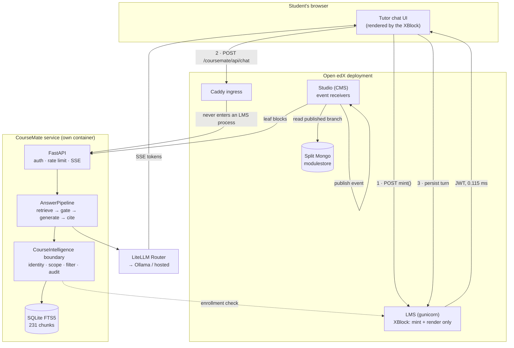
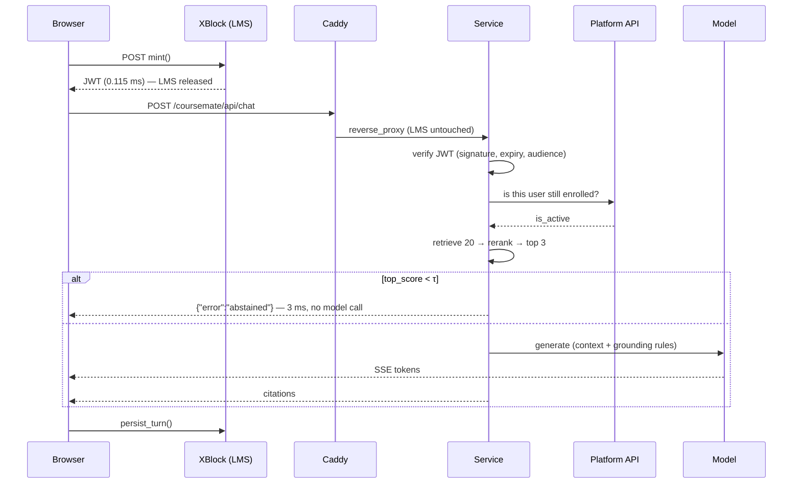
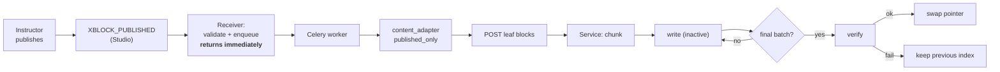

# CourseMate — Architecture

*How the system is built, and why each boundary is where it is. Every decision
here was made against a specific failure it prevents; the failures are named.*

---

## 1. The shape in one picture

**Read the numbers on the arrows.** The LMS appears three times, and never in the
answer path: it mints a token (1), it is bypassed during streaming (2), and it
stores the finished turn (3).

---

## 2. The decision that shaped everything

> **The XBlock mints a token. The browser does the talking.**

The obvious design is to proxy the stream through the XBlock's handler. That was
the original design, and it was wrong.

An XBlock handler that streams **holds a gunicorn worker for the entire
generation** — 5–15 seconds. It consumes no CPU, but a worker pool is exhausted
by **occupancy**, not computation. Two hundred students streaming concurrently is
two hundred occupied workers, and courseware rendering shares that pool. The LMS
goes down for students who never opened the tutor.

The earlier reasoning said *"the XBlock holds no work"* — true of computation,
false of connections, and only the second is what the pool counts. **A guarantee
stated in the wrong unit reads as satisfied when it isn't.**

### Measured

| | |
|---|---|
| JWT mint (server-side) | **0.115 ms** |
| LMS CPU during 7.6 s of streaming | **103 ms** |
| LMS CPU idle, 8 s, zero traffic | **118 ms** |
| LMS log lines during 3 concurrent streams | **0** |

Streaming consumed *less* than idle background noise.

### The cost, stated

The browser must reach the service, which appears to contradict "not
internet-exposed". Resolved by exposing it as a **path under the LMS origin**
(`/coursemate/*`) routed at Caddy: same-origin for the browser, no CORS, no
second published hostname, and the request never enters an LMS application
process. Ingest and admin routes stay off that path.

---

## 3. Component responsibilities

### 3.1 Platform package (inside Open edX)

Installed into LMS, CMS and Celery images. **Deliberately the thinnest part**, and
its dependency list is the enforcement: `XBlock`, `httpx`, `PyJWT`, `pydantic`.
No AI library, checked in CI.

| Module | Responsibility |
|---|---|
| `xblock/tutor_block.py` | `mint()` → JWT; `persist_turn()` → `Scope.user_state`. Never relays an answer |
| `adapters/content_adapter.py` | **The only module that touches the modulestore** |
| `events/cms_receivers.py` | `XBLOCK_PUBLISHED/DELETED/DUPLICATED` → validate + enqueue |
| `events/lms_receivers.py` | `COURSE_UNENROLLMENT_COMPLETED` → invalidate authz cache |
| `management/commands/coursemate_reindex.py` | Bootstrap indexing |

**Why the adapter owns the branch context.** `branch_setting` is thread-local and
defaults to `None`, so a Celery worker inherits nothing and falls back to
draft-preferred. An API shaped as *"call `iter_leaves()` inside a `branch_setting`
block"* **fails open**: one forgotten `with` silently indexes unpublished content
— no exception, no failing test, no symptom until a student is cited something
they cannot see. Every read opens the context internally.

**Why receivers are split by process.** `content_authoring` events fire in Studio;
`learning` events fire in the LMS. `PluginSignals.CONFIG` is keyed by project
type, so the split is what the plugin registry expects, not a stylistic choice.

### 3.2 Service (outside Open edX)

| Module | Responsibility |
|---|---|
| `api/chat.py` | Auth, rate limit, SSE encoding — **no AI logic** |
| `ai/pipeline.py` | retrieve → gate → prompt → stream → cite. Never raises |
| `ai/client.py` | LiteLLM Router: retries, cooldowns, fallbacks |
| `ai/retrieval.py` | `ContextProvider` over the boundary |
| `boundary/impl.py` | identity → scope → **filter before ranking** → audit |
| `boundary/authz.py` | Enrollment re-derivation against Open edX |
| `knowledge/store.py` | FTS5 index; write→verify→swap |
| `knowledge/rerank.py` | Coverage + proximity + title reranking |

---

## 4. Two flows that carry the guarantees

### 4.1 Answering

**The gate fires before generation.** Abstention costs 3 ms and zero model spend —
the design's claim that safety needn't cost latency, measured.

### 4.2 Ingestion

**Why the receiver only enqueues.** `openedx-events` signals are Django signals —
a receiver runs *synchronously, inside the instructor's Publish request*. Running
extract → chunk → embed inline would hang the Publish button on third-party
network I/O. Publishing a section with 40 leaves = 40 round-trips before the
button returns; if the provider is down, **Publish fails.** A core platform action
would then depend on our vendor's uptime.

**Why the swap boundary is the run, not the batch.** Each batch originally swapped
itself in and deactivated its predecessors: a 226-block course served **26 blocks
while reporting complete success**. Nothing failed; the content silently vanished.
`run_id` + `is_final` make the whole run the unit.

---

## 5. Security model

| Control | Mechanism | Failure it prevents |
|---|---|---|
| Identity | Short-lived JWT, verified every request | Forged callers |
| **Authorization** | **Enrollment re-derived from Open edX per call, 60 s cache** | A token outliving the enrollment it was minted under |
| Fail-closed | Platform unreachable → deny | Availability becoming an authz bypass |
| Isolation | tenant + offering filters **in the SQL** | Unauthorized content being a *candidate*, not merely unreturned |
| Credential split | Student token ≠ service credential | A leaked student token writing to the index |
| Injection | Retrieved text framed as quoted data | Prompt injection via course content |
| Structural | Tool surface is **read-only** | No prompt can change what students see |

**Why authorization is re-derived rather than trusted.** A signed, unexpired,
correctly-scoped token is *not sufficient*. The signature proves the token was
issued; it does not prove the enrollment still holds. Unenroll a student and their
token keeps working until expiry.

Verified: `admin` → allowed with 5 chunks; `nosuchuser` → denied.

---

## 6. Design decisions and their alternatives

| Decision | Alternative rejected | Why |
|---|---|---|
| Browser streams from service | Proxy through XBlock | Worker-pool exhaustion by occupancy |
| SQLite FTS5 + BM25 | Vector database | No embedding provider available; 231 chunks; deterministic therefore testable; swappable behind `ContextProvider` |
| Coverage gates, BM25 ranks | BM25 for both | BM25 magnitude is corpus-dependent — excellent for ordering, meaningless as an absolute confidence |
| Platform reads, service transforms | Worker embeds too | Co-locates embedder with its cache; makes write→verify→swap a local transaction |
| Lexical reranker first | Cross-encoder | ~1 GB over a 0.6 MB/s link, and **unmeasurable against nothing** |
| One record per leaf block | Batch blob | Enforces "never merge two blocks" in the wire format, not a conditional |

---

## 7. What is designed and deliberately dormant

Present in the repository with schema and rationale, wired to nothing:

- **Proposal queue** (`proposals/`) — the MVP generates no course content, so
  nothing needs approval. Principle 2 is satisfied by construction rather than by
  a review UI.
- **Cache tiers** (`knowledge/cache/`) — rules and tests exist; **no cache is in
  the request path.** Its README says so first, because a passing test named
  *"personal results are never cacheable"* otherwise reads as an active control.
- **Exam prep contracts** (`contracts/examprep.py`) — Feature B's data model.

`.importlinter` prevents any of these being wired accidentally.
